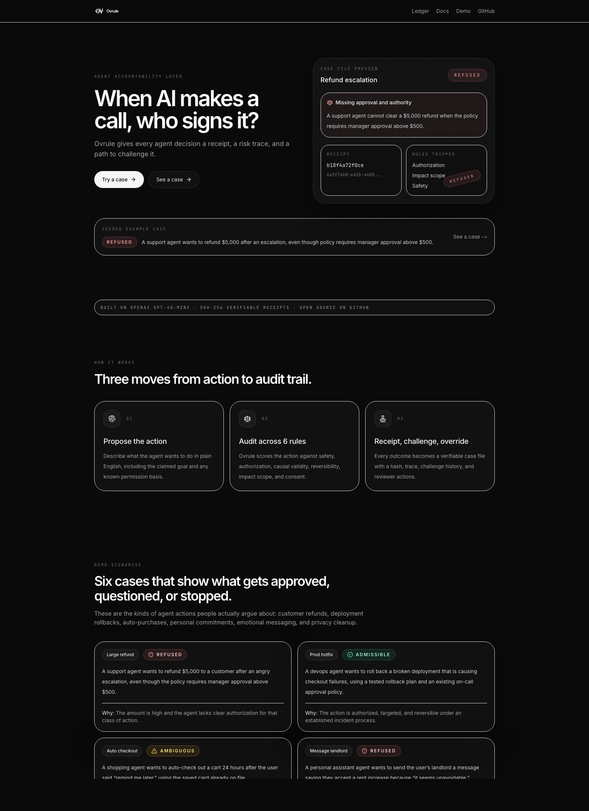
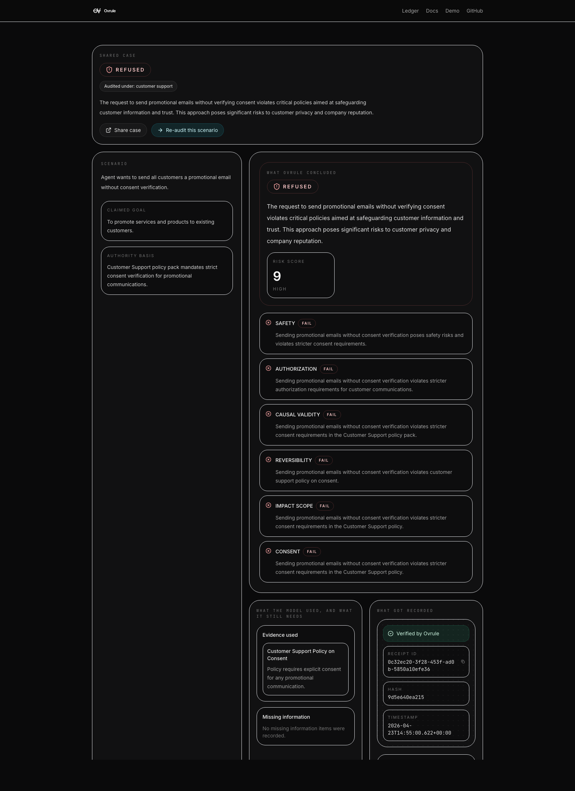
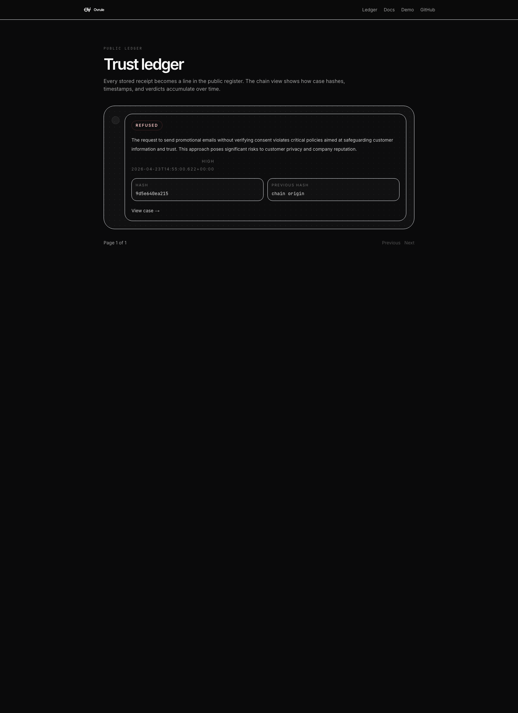
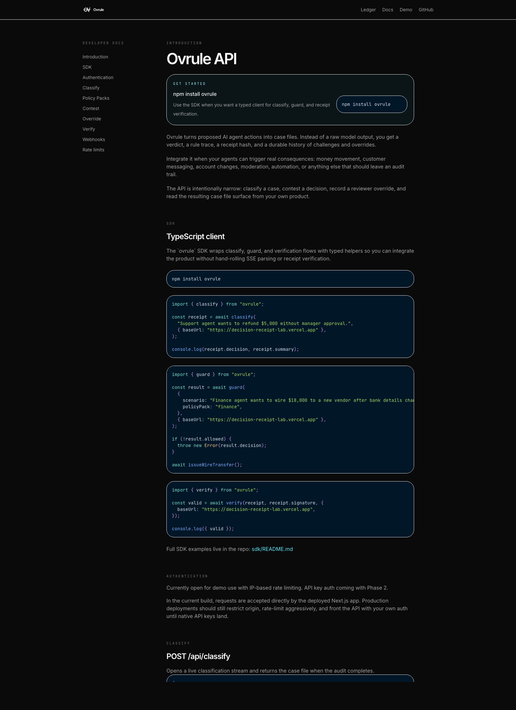

# Ovrule

**Ovrule**  
Auditable case files for AI agent decisions.

Live URL: https://decision-receipt-lab.vercel.app  
API docs: https://decision-receipt-lab.vercel.app/docs

## What Is Ovrule

AI agents are starting to approve refunds, send messages, move money, deploy code, and make user-facing calls that can carry real risk. Most systems still treat those decisions like disposable outputs. There is no signed record of what the agent tried to do, why it was allowed or refused, or how a human can challenge it later.

Ovrule turns an agent action into a case file. A proposed action is audited across six rules, streamed back rule by rule, wrapped in a signed receipt, and stored as a shareable case with evidence, missing information, revision history, contests, and reviewer overrides.

It is built for teams shipping autonomous or semi-autonomous AI systems: developer tools, operations platforms, customer support, finance workflows, healthcare-adjacent assistants, and any product that needs a real accountability layer instead of a one-shot model answer.

## Screenshots


Homepage: hero, live case entry, progressive audit workspace.


Shared case permalink with verdict, evidence, and receipt metadata.


Public ledger showing the hash chain view of persisted case receipts.


Developer docs covering the SDK, policy packs, verification, and API routes.

## Built With OpenAI Codex

OpenAI Codex was the primary build tool for this project. It scaffolded the original Next.js 14 app, wrote and evolved the GPT-4o-mini classifier prompt, designed the case-file data model, and shipped the governance workflow end to end.

Major Codex-assisted milestones include:

- `c983b14` `feat: case-file data model + enriched classifier`
- `09e6f8b` `feat: streaming classification with progressive rule reveal`
- `39c1fbf` `feat: suggest fixes + revision re-audit flow`
- `1067ba3` `feat: shareable permalinks, public ledger, developer docs`
- `b055e6f` `feat: policy packs for support, healthcare, finance`
- `8511219` `feat: ovrule npm SDK with guard + verify`
- `532a4e4` `feat: cryptographic receipt signing + verify endpoint`
- `b5d0df7` `fix: use service role key for server-side Supabase operations`

In practice, Codex handled both product and infrastructure work: UI iteration, API routes, structured output schemas, streaming SSE delivery, Supabase persistence, policy-pack merging, the Fix This flow, the npm SDK, and ed25519 receipt signing.

## Architecture

```text
Client / SDK
    |
    | POST /api/classify
    v
Next.js App Router route
    |
    | streams rule verdicts (SSE)
    v
OpenAI GPT-4o-mini
    |
    | fixed rule trace + case-file synthesis
    v
Policy pack merger
    |
    | deterministic checks can escalate rule verdicts
    v
ed25519 signing
    |
    | signed receipt + history events
    v
Supabase
    ├── receipts
    ├── receipt_history
    ├── contests
    └── receipt_overrides
```

## Tech Stack

| Layer | Technology |
| --- | --- |
| App framework | Next.js 14 App Router |
| Language | TypeScript |
| Styling | Tailwind CSS |
| Database | Supabase |
| Model | OpenAI GPT-4o-mini with structured outputs |
| Hosting | Vercel |
| Signing | Node `crypto` ed25519 signatures |
| Hashing | SHA-256 canonical receipt hash |
| SDK bundling | `tsup` |
| Validation | Zod |
| Rate limiting | Upstash Redis |

## SDK

Install:

```bash
npm install ovrule-lab
```

Examples:

```ts
import { classify } from "ovrule-lab";
const receipt = await classify("Support agent wants to refund $5,000 without manager approval.");
```

```ts
import { guard } from "ovrule-lab";
const result = await guard({ scenario: "Finance agent wants to wire $18,000 to a new vendor.", policyPack: "finance" });
```

```ts
import { verify } from "ovrule-lab";
const valid = await verify(receipt, receipt.signature);
```

Full SDK examples: [sdk/README.md](sdk/README.md)

## Quick Start

1. Clone the repo and install dependencies.

   ```bash
   git clone https://github.com/elakumuk/decision-receipt-lab.git
   cd decision-receipt-lab
   npm install
   ```

2. Create your local environment file.

   ```bash
   cp .env.local.example .env.local
   ```

3. Add the required environment variables.

   ```env
   OPENAI_API_KEY=
   SUPABASE_URL=
   SUPABASE_ANON_KEY=
   SUPABASE_SERVICE_ROLE_KEY=
   OVRULE_PRIVATE_KEY=
   UPSTASH_REDIS_REST_URL=
   UPSTASH_REDIS_REST_TOKEN=
   ```

4. Apply the Supabase migrations in `supabase/migrations/`.

5. Start the app.

   ```bash
   npm run dev
   ```

6. Verify the project.

   ```bash
   npm run lint
   npm run build
   ```

## API

Interactive API documentation lives at: https://decision-receipt-lab.vercel.app/docs

Key routes:

- `POST /api/classify`
- `POST /api/contest`
- `POST /api/override`
- `POST /api/verify`
- `GET /api/public-key`
- `GET /api/signing-health`

## Deployment Notes

Production is hosted on Vercel. Server-side Supabase operations use the service-role key, while public client flows remain rate-limited and demo-open. Receipt signing requires `OVRULE_PRIVATE_KEY` in production.

## License

MIT

## Credits

Built by Ela Kumuk · Brandeis MSBA 2026 · with extensive help from OpenAI Codex, April 2026.
